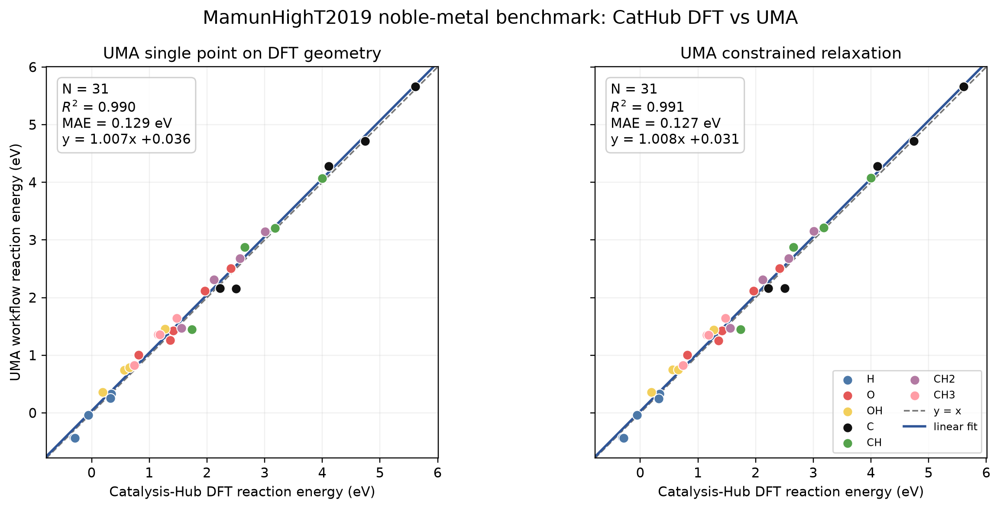

# Vibe Catalysis Agent

A local, multilingual natural-language interface for reproducible
Catalysis-Hub × ASE × FAIR-Chem UMA heterogeneous-catalysis calculations.

The agent converts a request such as:

```text
比较 Cu、Ag 和 Pd(111) 上 C、CH、CH2、CH3 的吸附
```

into a validated calculation plan, preserves the deposited slab constraints,
and runs UMA single-point energies plus constrained ASE relaxation.

It has three deliberately separated modes:

1. **Database-backed benchmark:** H/O/OH/C/CH/CH2/CH3 structures from
   `MamunHighT2019` are compared directly with deposited DFT references.
2. **ASE automatic prediction:** general intermediates, including
   CO/CHO/COH/CHOH/CH2OH and N/N2/NH/NH2/NH3, are generated
   from scratch, relaxed with UMA, screened for failed geometries, and ranked.
   These are predictions, not DFT benchmark values.
3. **Uploaded clean slab prediction:** an ASE-readable CIF, POSCAR/CONTCAR,
   XYZ/EXTXYZ, or TRAJ structure supplies the catalyst slab. The workflow
   discovers top-layer adsorption coordinates, preserves existing constraints
   (or fixes the bottom layers), and runs the same UMA screening and graphics.

## What is included

- Multilingual local parser: Chinese, English, Spanish, French, German, and
  chemical-formula-led Japanese input.
- No paid LLM or ChatGPT subscription required.
- A validated JSON plan is shown before calculation.
- CatBench retains the deposited ASE `FixAtoms` constraints: the bottom 8 of
  12 slab atoms are fixed for this dataset.
- FAIR-Chem `uma-s-1p2` with the `oc20` task.
- Offline parser tests and a real Cu(111)/H integration test.
- A 31-case Cu/Ag/Au/Pt/Pd benchmark and parity plot.
- Automatic ASE reference-state detection for elemental fcc/bcc/hcp metals.
- User-supplied catalyst slabs, including alloys, oxides, defects, and supported
  models, provided they are already prepared as a clean periodic slab.
- Common low-index surfaces plus arbitrary cubic three-index Miller surfaces,
  including stepped surfaces such as Pt(211). Prepared non-cubic high-index
  structures can be supplied in any ASE-readable format.
- Surface-specific ASE high-symmetry sites; site names are never copied from an
  incompatible surface.
- CO C-down/O-down enumeration; three azimuths for larger C/O/H intermediates.
- Bottom-layer constraints, geometry checks, candidate table, and best structure.
- Automatic publication-style energy graphics with ASE-native relaxed-structure
  top views, standard element colours/radii, and the periodic unit cell.
- UMA NEB/CI-NEB forward/reverse activation barriers and TS candidates.
- Ideal single-site mean-field steady-state microkinetics from elementary barriers.
- Nature/CatMAP-style pathway figures in SVG, PDF, TIFF, and PNG with source data.

## Requirements

- macOS or Linux; Windows users should use WSL.
- Conda/Miniforge.
- About 5 GB free disk space.
- A Hugging Face account with access granted for
  [`facebook/UMA`](https://huggingface.co/facebook/UMA).
- CPU works. NVIDIA CUDA is faster. FAIR-Chem 2.21 does not use Apple MPS.

Do not share Hugging Face access tokens or commit them to this repository.

## Installation

```bash
git clone https://github.com/aonixu-usyd/vibe-catalysis-agent.git
cd vibe-catalysis-agent
conda env create -f environment.yml
conda activate cathub-uma
hf auth login
```

The UMA checkpoint downloads on the first real calculation after model access
has been granted.

## Test the installation

### 1. Fast test without loading UMA

```bash
python test_agent.py
```

Expected output:

```text
PASS: 6 dataset parser cases, 10 automatic parser cases, fcc/bcc/hcp builders, constraints/orientations, and 1 safety rejection
SKIP: UMA integration test (run with --integration)
```

### 2. Full end-to-end UMA test

```bash
python test_agent.py --integration
```

This performs a real CatHub-matched Cu(111)/H calculation. Approximate values:

```text
PASS: real UMA integration test
CatHub DFT:       -0.0536 eV
UMA single point: -0.0362 eV
UMA relaxed:      -0.0370 eV
```

Small numerical differences may occur across software versions.

## Natural-language usage

Preview the validated plan without calculating:

```bash
python vibe_agent.py "Benchmark CHx on Cu, Ag and Pd(111)"
```

Execute after reviewing the plan:

```bash
python vibe_agent.py \
  "比较 Cu、Ag 和 Pd(111) 上 C、CH、CH2、CH3 的吸附" \
  --execute
```

Skip the confirmation prompt only for trusted scripted runs:

```bash
python vibe_agent.py "Calculate H adsorption on Cu(111)" --execute --yes
```

More examples are in [`examples_multilingual.md`](examples_multilingual.md).

### Automatic modelling without a database structure

Preview the plan:

```bash
python vibe_agent.py "计算CO在Cu(111)上的吸附能"
```

Build, relax, screen, and rank all candidates:

```bash
python vibe_agent.py "计算CO在Cu(111)上的吸附能" --execute --yes
```

The crystal structure and a sensible default facet are inferred from ASE when
the facet is omitted: fcc→(111), bcc→(110), and hcp→(0001).

```bash
python vibe_agent.py "Calculate CO adsorption on Ni(100)" --execute --yes
python vibe_agent.py "Calculate NH2 adsorption on Pt(211)" --execute --yes
python vibe_agent.py "计算CO在Fe(110)上的吸附能" --execute --yes
python vibe_agent.py "计算CHO在Co(0001)上的吸附能" --execute --yes
python vibe_agent.py "计算CO在Ru(10-10)上的吸附能" --execute --yes
```

The automatic backend can also be called directly for full control:

```bash
python predict_adsorption.py \
  --metal Fe --facet 110 --adsorbate CO \
  --size 3 3 4 --fixed-layers 2
```

### Reaction barriers and mechanisms

Natural-language Skill calls are translated internally into a validated reaction plan;
users do not need to author JSON or Python. The deterministic backend can also run a
prepared plan directly:

```bash
python reaction_workflow.py reaction_plan.json --output results/mechanism
```

Each elementary step may request UMA NEB/CI-NEB. The workflow writes forward/reverse
barriers, a TS candidate, steady-state microkinetic results when requested, and a
Nature/CatMAP-style figure bundle. PCET endpoints must explicitly contain the same atoms,
including the transferred proton and interfacial donor/acceptor environment.

### Use your own catalyst model

Pass the uploaded/local structure separately from the natural-language request:

```bash
python vibe_agent.py \
  "用这个上传的催化剂模型计算 CO 吸附能" \
  --structure /path/to/POSCAR --execute --yes
```

Or call the scientific backend directly:

```bash
python predict_adsorption.py \
  --structure /path/to/catalyst.cif --adsorbate CO
```

Supported input includes CIF, POSCAR/CONTCAR, XYZ, EXTXYZ, TRAJ, and other
formats readable by ASE. Every atom already present in the uploaded file is
treated as part of the **catalyst/framework**, regardless of element. Thus C,
O, N, and H in COFs, MOFs, oxides, nitrides, hydroxylated surfaces, or supported
catalysts are never inferred to be adsorbates. The adsorbate is only the new
species explicitly named in the request. The source file is read-only: every
generated candidate and relaxed result is written to the result directory.

For an uploaded structure, the workflow:

- checks the cell, in-plane periodicity, and approximate vacuum;
- preserves `FixAtoms`/selective-dynamics constraints when ASE reads them;
- otherwise fixes the requested number of bottom atomic layers;
- discovers indexed `ontop`, `bridge`, and threefold `hollow` coordinates from
  the uppermost surface atoms, with a configurable cap per site type;
- records the absolute source path, SHA-256 hash, formula, constraints, and
  validation warnings in `plan.json` and `summary.json`.

Use `--site-types`, `--top-layer-tolerance`, and `--max-sites-per-type` to tune
automatic discovery. For a known adsorption coordinate, bypass discovery with
one or more `--site-xy X Y` options. Add `--replace-constraints` only when you
intentionally want to discard constraints read from the source and regenerate
bottom-layer constraints.

For a COF/MOF, porous framework, oxide, defect, or supported catalyst, define
the chemically relevant region explicitly when possible. Atom indices are
zero-based:

```bash
python vibe_agent.py \
  "在上传的 COF 模型活性位点计算 CO 吸附" \
  --structure /path/to/cof.cif \
  --active-atom-indices 18 24 31 --execute --yes
```

This generates candidate sites from those framework atoms only. Alternatively,
use repeated `--site-xy X Y` coordinates for experimentally or chemically
identified sites.

Automatic coordinate discovery is a screening heuristic, especially for
reconstructed, stepped, porous, or multicomponent surfaces. Review the ASE top
views and candidate table before interpreting the energies. Paired
An uploaded structure that intentionally contains a pre-adsorbed species is
still treated as one combined catalyst substrate unless paired-state analysis
is explicitly requested; automatic decomposition into “slab” and “old
adsorbate” is deliberately not attempted.

If `--sites` is omitted, every named ASE site available for that surface is
used. Examples include:

| Crystal/surface | Named ASE sites used by default |
|---|---|
| fcc(111), hcp(0001) | ontop, bridge, fcc, hcp |
| fcc(100), bcc(100) | ontop, bridge, hollow |
| fcc(110), bcc(110) | ontop, longbridge, shortbridge, hollow |
| bcc(111) | ontop, hollow |
| hcp(10-10) | ontop |

Element symbols are accepted when ASE lists an elemental fcc/bcc/hcp reference
state. Examples include Ni/Rh/Ir (fcc), Fe/V/Cr/Mo/W (bcc), and
Co/Ru/Ti/Zr/Hf (hcp). `--crystal-structure` and lattice constants can override
the reference phase for an intentionally metastable structure.

Outputs are written to a new results directory:

- `plan.json`: exact modelling and optimization settings;
- `candidates.csv`: every site/orientation and its status;
- `summary.json`: references, accepted count, and lowest-energy candidate;
- `structures/*_initial.extxyz` and `*_final.extxyz`;
- `best_structure.extxyz`;
- `energy_and_topviews.png`: a single-energy card or site-comparison bar chart,
  plus ASE-native top views of the selected relaxed structures;
- `visualization.json`: plotted values, structures, and visualization mode;
- ASE optimizer trajectories and logs.

The visualization mode is selected from the accepted results:

- one accepted energy → a clean numerical energy card;
- two or more adsorption sites → a bar chart using the lowest accepted
  orientation at each site;
- multiple adsorbates requested together → a step-style adsorption-energy
  profile and one best-structure top view per intermediate.

Reaction charts follow connectivity rather than state count:

- one directed reaction → one numerical reaction-energy card;
- competing reactions with one common reactant (`CO→CHO` vs `CO→COH`) → a
  reaction-energy bar chart;
- at least two consecutive steps (`CO→CHO→CHOH`) → a connected step profile.

The workflow never draws a connector between competing products. Numerical
directed-step values are saved separately in `che_reaction_energies.csv`.

For hydrogenation intermediates in the CO family, the comparison also computes
the computational-hydrogen-electrode quantity from relaxed total energies:

```text
ΔE_CHE(CO* → CHO*) = E(CHO*) − E(CO*) − ½E(H₂)
ΔG_CHE,approx(U,pH) = ΔE_CHE + eU + kBT ln(10) pH
```

The workflow writes the numerical values to `che_energies.csv` and the profile
JSON. Defaults are 0 V vs SHE, pH 0, and 298.15 K; use `--potential-v`, `--ph`,
and `--temperature-k` to change them. This is an electronic-energy CHE
approximation, not a complete free energy: ZPE, entropy, solvation, electric
field, and other corrections are not included unless supplied separately.

For example, this runs both intermediates and creates
`adsorption_energy_profile.png`:

```bash
python vibe_agent.py "计算CO和CHO在Cu(111)上的吸附能" --execute --yes
```

Completed prediction directories can be visualized again without rerunning UMA:

```bash
python visualize_results.py results/job/CO
python visualize_results.py results/job/CO results/job/CHO \
  --output results/job/adsorption_energy_profile.png
```

The multi-intermediate step plot compares independently referenced adsorption
energies. It is explicitly labelled as a screening profile, not a balanced
reaction-energy or free-energy diagram. A strict CO→CHO diagram needs a
consistent hydrogen chemical potential and any desired zero-point,
temperature, entropy, solvent, and electrode-potential corrections.

For CO, the default search is 4 sites × C-down/O-down = 8 candidates. For
CHO, COH, CHOH, and CH2OH, C anchoring and 0/120/240° azimuths are enumerated.

## Scientific definitions

The workflow evaluates the balanced Catalysis-Hub reaction definitions with
the same UMA calculator for all surface and gas structures:

| Species | Reaction definition |
|---|---|
| H | `0.5 H2(g) + * -> H*` |
| O | `H2O(g) - H2(g) + * -> O*` |
| OH | `H2O(g) - 0.5 H2(g) + * -> OH*` |
| C | `CH4(g) - 2 H2(g) + * -> C*` |
| CH | `CH4(g) - 1.5 H2(g) + * -> CH*` |
| CH2 | `CH4(g) - H2(g) + * -> CH2*` |
| CH3 | `CH4(g) - 0.5 H2(g) + * -> CH3*` |

Relaxation uses ASE LBFGS, `fmax = 0.05 eV/Å`, and at most 100 steps.

For automatically generated structures, the direct UMA adsorption energy is

```text
E_ads(X) = E_UMA(slab + X) - E_UMA(clean slab) - E_UMA(X gas)
```

All three terms use the same UMA `oc20` task. Clean slab, gas reference, and
adsorbed structures are relaxed independently. CHO and COH are treated as
different bonded isomers. The result is labelled as an UMA prediction unless a
matched Catalysis-Hub DFT record is added separately.

## Automatic CO/Cu(111) demonstration

On the tested Apple M4 Pro CPU, the cached-model 3×3×4 calculation took about
two minutes. Eight candidates completed; all four O-down candidates desorbed
and were excluded by the geometry checker. The lowest accepted UMA candidate
was hcp C-down with `E_ads = -0.4747 eV`. See
[`results/demo_CO_Cu111_auto`](results/demo_CO_Cu111_auto).

This site preference should not be interpreted as validated chemistry. CO on
Cu(111) is a sensitive test and the UMA ranking must be compared with a matched
DFT dataset. The disagreement itself is useful benchmark evidence.

## Baseline result

For the 31 available noble-metal cases:

| Mode | N | MAE (eV) | RMSE (eV) | R² |
|---|---:|---:|---:|---:|
| UMA single point on DFT geometry | 31 | 0.1287 | 0.1511 | 0.9904 |
| UMA constrained relaxation | 31 | 0.1270 | 0.1490 | 0.9907 |



High R² is partly driven by the broad reaction-energy range. Report MAE and
per-case errors alongside R². This is an in-domain baseline and is not evidence
of transferability to arbitrary catalysts, coverages, solvents, electrochemical
potentials, or transition states.

## Data provenance

- Catalysis-Hub publication: `MamunHighT2019`
- Dataset paper: <https://doi.org/10.1038/s41597-019-0080-z>
- Materials Cloud archive: <https://doi.org/10.24435/materialscloud:2019.0015/v1>
- CatBench compact dataset: <https://doi.org/10.5281/zenodo.17157085>
- FAIR-Chem: <https://github.com/facebookresearch/fairchem>
- ASE: <https://ase-lib.org/>

Please cite the underlying dataset, CatBench, FAIR-Chem/UMA, and ASE as
appropriate when using the results.

## Limitations

- The packaged DFT reference subset does not contain CO/CHO/COH/CHOH/CH2OH;
  those species currently use automatic prediction mode.
- Unsupported crystal/facet combinations are rejected rather than silently
  reconstructed. The builder covers fcc(111/100/110), bcc(111/100/110), and
  hcp(0001/10-10), not arbitrary Miller indices.
- ASE reference-state availability means the geometry can be constructed; it
  does not establish that UMA is accurate for that element, magnetic state, or
  surface. Magnetic ordering and spin-state benchmarking are not included.
- The automatic builder models one adsorbate per cell, named ASE
  high-symmetry sites, and vacuum calculations. It does not include solvent,
  electrode potential, co-adsorbates, defects, or transition states.
- Polyatomic site/orientation enumeration is finite and may miss a lower-energy
  configuration. Geometry checks flag desorption, penetration, bond breaking,
  and large surface reconstruction but do not prove chemical correctness.
- The local language parser uses constrained rules; an LLM is not required.
- UMA predictions are a fast MLIP baseline and should not be presented as
  independently converged DFT results.

See [`SHARING.md`](SHARING.md) for a shorter recipient setup guide.
